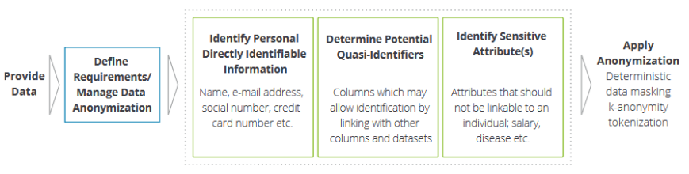

# Analisi del dominio e del contesto

## Analisi del contesto

### Anonimizzazione e pseudoanonimizzazione
Il GDPR (Regolamento generale sulla protezione dei dati) definisce le informazioni anonime come "informazioni che non si riferiscono a una persona fisica identificata o identificabile o a dati personali resi sufficientemente anonimi da impedire o da non consentire più l'identificazione dell'interessato".

Pertanto l'anonimizzazione è un processo che si occupa di rimuovere identificatori personali (diretti o indiretti che siano) che potrebbero portare un individuo ad essere identificato. 
Un identificatore è diretto quando un individuo può essere identificato attraverso un singolo dato, come il proprio nome, indirizzo, numero di telefono ecc.
Invece un identificatore è detto indiretto se un individuo può invece essere identificato aggregando più dati, come luogo di lavoro, titolo, indirizzo postale o una diagnosi ospedaliera.
Se un dato è stato correttamente anonimizzato, esso non può più essere associato ad un certo individuo, dunque il dato può rientrare nell'ambito della GDPR ed è più semplice da utilizzare

La pseudoanonimizzazione è un concetto leggermente diverso dall'anonimizzazione, viene definito dal GDPR come "il trattamento dei dati personali in modo tale che i dati personali non possano più essere attribuiti a un interessato specifico senza l'utilizzo di informazioni aggiuntive, a condizione che tali informazioni aggiuntive siano conservate separatamente e soggette a misure tecniche e organizzative intese a garantire che tali dati personali non siano attribuiti a una persona fisica identificata o identificabile". La pseudoanonimizzazione è quindi un processo reversibile, mentre con l'anonimizzazione l'identità degli individui è irrecuperabile.

## Processo di anonimizzazione
Deloitte descrive attraverso il seguente diagramma il processo attraverso cui si dovrebbero anonimizzare i dati.

  

Alla base di tutto vi sono i dati, essi potrebbero essere rappresentati in una moltitudine di formati come es. tabelle di excel, file csv o liste di stringhe. Per anonimizzare tali dati il primo passo è una corretta analisi della loro struttura, il cui fine è la comprensione e il riconoscimento da parte dell'analista o del personale incaricato di quali dati sono i più significativi, la cui integrità dovrà pertanto essere mantenuta. 

Una volta che si sono ottenuti i dati, si classificano gli attributi dei dati, questi possono essere:
1. Identificatori diretti: come nome, indirizzo, numero di telefono, numero di targa, indirizzo e-mail ecc.
2. Identificatori indiretti: sesso, data di nascita, età, codice postale, numero di figli ecc.

Successivamente viene definito quello che si dice attributo sensibile, partendo da questo si misura il rischio di identificazione e lo si collega ad una soglia di rischio che rappresenta il grado di rischio che si ritiene accettabile.
Un valore di soglia pari a zero non consentirebbe la condivisione di dati utili, mentre un valore uno significa che nessun dato è anonimizzato.

Dopo aver indentificato quali dati dovrebbero essere anomizzati e quali no, diventa importante identifcare la tecnica più adeguata in base al settore di riferimento. Più precisamente, la tecnica utilizzata deve permettere il trattamento dei dati in maniera tale da non consentire l'identificazione della persona interessata mediate l'insieme dei mezzi che possono essere ragionevolmente utilizzati.
Nel prossimo capitolo si andranno a descrivere alcune delle tecniche utilizzate (che sono tutt'ora oggetto di ricerca).

## Tecniche di anonimizzazione
Di seguito sono descritte alcune delle tecniche di anonimizzazione che vengono generalmente utilizzate.

1. Introduzione di rumore statistico: Consiste nell'introduzione di una perdurbazione in alcuni tipi di attributi i cui valore diventa meno accurato pur mantenendo la distribuzione generale.
Nonostante alcuni valori vengano approssimati, rimane comunque un tecnica efficace. 
Un esempio può essere l'altezza di una persone che invece di essere precisa è approssimata ai 5cm. Più individui si troveranno ad avere la stessa altezza come se fossere raggruppati per classi ad intervalli di 5 cm.
2. k-anonymization: ogni rilascio di dati deve essere tale per cui qualsiasi combinazione di quasi identificatori corrisponda ad almeno k identità; si ottiene generalizzando i valori dei identificatori indiretti, per esempio invece di fornire un’età precisa si raggruppano le persone per fasce di età e in ogni fascia sono contenuti almeno k individui. La tecnica si può applicare agli attributi numerici ma anche ad altri riducendo il livello di dettaglio come ad esempio la sostituzione della provincia al posto del paese. Una tecnica simile è la generalizzazione che si ottiene per esempio modificando il valore di un CAP: eliminando l’ultima cifra si raggruppano le persone non più per paese ma per aree di 10 CAP diversi. La k-anonymity richiede che in una tabella ogni quasi identificatore sia presente almeno k volte.
3. l-diversity: in ogni classe di equivalenza di una tabella (insieme di tuple con uno stesso valore per un quasi attributo) un attributo sensibile deve avere almeno “l” valori diversi. Può essere usata per estendere la k-anonymity. Perché sia efficace la distribuzione in un insieme di record deve essere il più possibile vicina a quella della popolazione originale; per esempio se in una popolazione di pazienti il 30% ha una patologia, allora nell’insieme di record che soddisfa la l-diversity la percentuale di pazienti con la stessa patologia deve essere molto vicina al 30%, in caso contrario si possono verificare casi di asimmetria e similarità fra tuple tramite cui è possibile ridurre le classi di appartenenza e dedurre informazioni più dettagliate sui singoli pazienti ovvero stimare con una maggiore probabilità le informazioni riservate su un individuo.
4. t-closeness (t-vicinanza): realizza un affinamento della l-diversity, ovvero tende a realizzarne la condizione migliore in cui la distribuzione iniziale degli attributi nella tabella viene rispettata anche nelle singole classi di appartenenza. Una classe di equivalenza rispetta la t-closeness se la distanza tra la distribuzione dei valori dei quasi identificatori nella classe e nell’intera popolazione è inferiore a “t”; in altre parole l’intero insieme di record e una sua parte hanno una distribuzione delle informazioni molto simile per cui non è possibile dedurre dettagli maggiori da quelli già noti.
5. differential privacy: lo scopo dell’algoritmo è fare in modo che la distribuzione di probabilità dei dati pubblicati sia la stessa indipendentemente dalla presenza nel dataset delle informazioni di un individuo oppure no. Lo scopo è evitare che si possa rilevare la presenza o l’assenza delle informazioni di un individuo in un dataset. Si realizza introducendo del rumore statistico casuale sul dataset ma a posteriori di una interrogazione (query), quindi senza modificare i dati originali. Maggiore è il rumore introdotto e maggiore è il livello di privacy ma minore è l’accuratezza. Come algoritmo fornisce una protezione migliore rispetto alla k-anonymization, tuttavia non garantisce una protezione completa.

Esiste un elemento importante che permette di attaccare i diversi algoritmi descritti. In ogni caso di pubblicazione dati è necessario considerare il cosiddetto “external knowledge” rappresentato dalla conoscenza di alcuni dettagli sugli individui di una popolazione che una terza parte possiede. Queste informazioni oltre che essere note a priori per i più disparati motivi, quali amicizia, popolarità, possono anche essere ricavate lavorando su diversi dataset rilasciati da diverse organizzazioni, da rilasci periodici dello stesso dataset con aggiornamenti e il livello di conoscenza che producono non è noto a priori.
