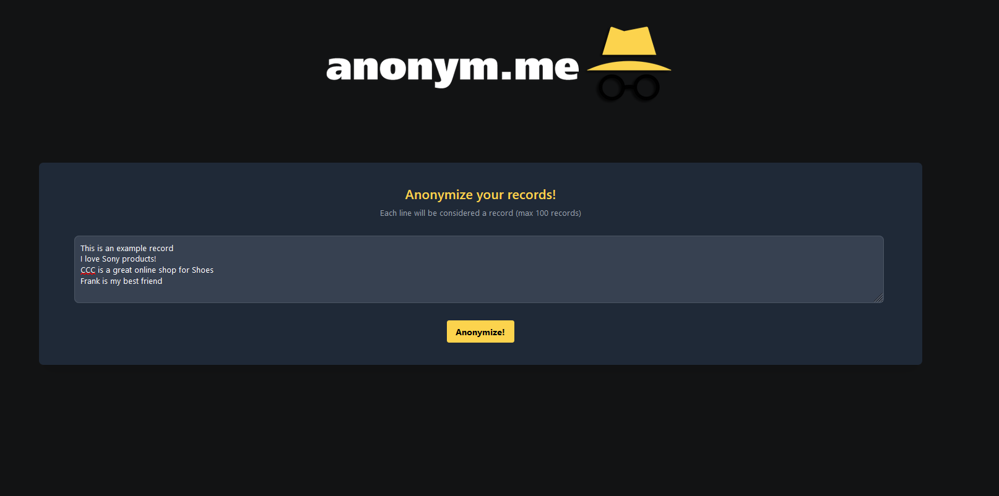
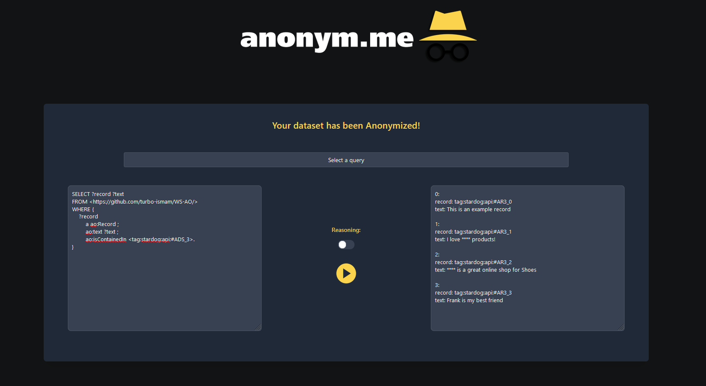
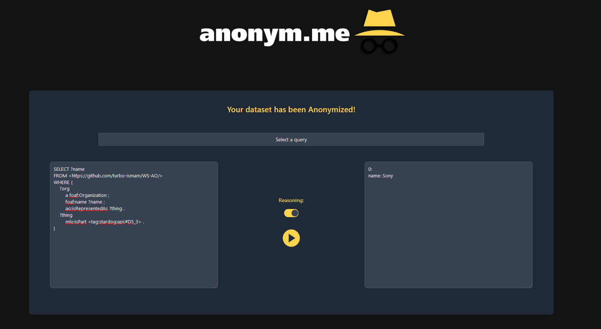

# Descrizione dell'applicativo
L'applicativo è stato realizzato con l'obiettivo di mostrare una possibile applicazione in domini reali dell'ontologia, fornendo un esempio per aiutare a comprenderne la struttura e mostrare come essa posso verire utilizzata nel processo di anonimizzazione dei dati.
Per l'implementazione è stato scelto il linguaggio TypeScript attraverso il framework Node.js e le seguenti librerie:
1. Solidjs: libreria per la creazione di interfacce utente reattive
2. Stardog.js: pacchetto npm ufficiale per comunicare con un'istanza di Stardog
3. bert-large-NER: una libreria di Token Classification sviluppata dalla community di Hugging Face utilizzata per identificare all'interno di un testo i dati potenzialmente sensibli

**Anonym.me** è un applicativo Web che permette di anonimizzare una serie di record inseriti dall'utente. Dato che tale applicativo è soltato un esempio di come è possibile utilizzare l'ontologia, gli elementi considerati sensibili sono solamente i **nomi di Organizzazioni** riconosciuti dalla libreria best-large-NER con confidenza maggiore al 60%.

Prima che un utente possa utilizzare l'applicativo, è necessario inserire nell'ontologia tutte le entità che non dipendono dall'input dell'utente (per esempio le possibili tecniche di anonimizzazione applicabili ai dati sorgente).

Per un utente che utilizza l'applicativo è possibile anonimizzare delle informazioni passando in input del testo contentente, per ciascuna riga, un record da anonimizzare (ciascuna riga verrà contata come record). Una volta premuto il pulsante "Anonymize", dai record inseriti verranno estratte le variabili sensibili e l'utente sarà reindirizzato alla pagina delle query. Il processo effettuato dall'applicativo è il seguente:
1. Tramite la richiesta Api al ML, vengono identificate i dati sensibili all’interno del record (passaggio eseguito immediatamente data la possibilità che le API non siano disponibili)
2. Vengono create le entità Dataset e AnonymizedDataset in modo da avere un riferimeno per i Record
3. Vengono inseriti i Record del Dataset e record dell'AnonimizedDataset
4. Eventuali dati sensibili individuati vengono collegati al relativo Record nonchè alle relative entità che rappresentano

Una volta reindirizzato alla pagina delle Query è possibile eseguire (con o senza reasoner) le query descritte nel capitolo precedente o query create sul momento dall'utente.

# Immagini dell'applicativo

  
   <em>Home page</em>

  
   <em>Pagine delle query con esempio di Dataset anonimizzato</em>

  
   <em>Esempio di query con reasoner</em>

